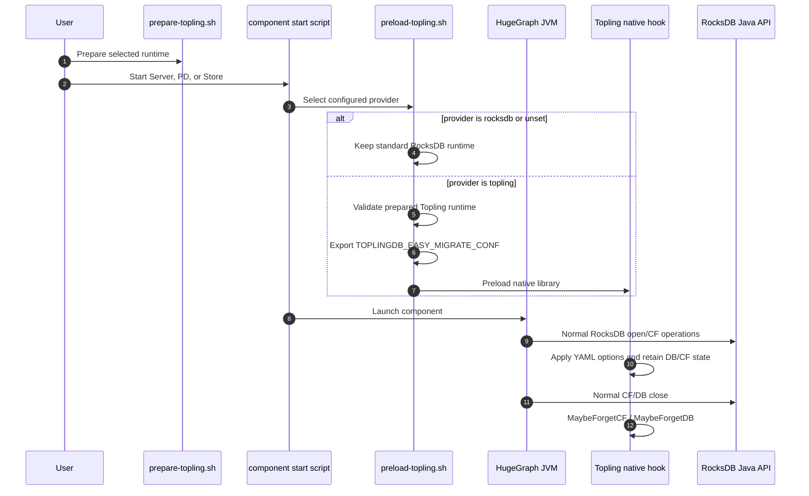

# Design of ToplingDB Easy Migrate

## Overview

ToplingDB is an optional RocksDB-compatible runtime for HugeGraph. HugeGraph
Server, PD, and Store keep their existing RocksDB Java API calls. The
integration does not add a Java provider SPI and does not create or manage a
`SidePluginRepo`.

Easy Migrate is activated before the JVM starts:

1. The installation layer prepares the selected JAR, native library, and Web
   resources.
2. The startup layer selects `rocksdb` or `topling` from the component
   configuration.
3. For `topling`, the startup layer exports
   `TOPLINGDB_EASY_MIGRATE_CONF`, `LD_LIBRARY_PATH`, and `LD_PRELOAD`.
4. The JVM opens and closes RocksDB through the existing Java API.
5. The Topling native hook imports the YAML options and tracks the normal
   DB/column-family lifecycle.

## Goals

- Keep the standard RocksDB Java API and the existing HugeGraph storage
  lifecycle.
- Make ToplingDB an explicit, startup-time selection.
- Apply component-specific YAML configuration through Easy Migrate.
- Preserve a strict standard RocksDB fallback when ToplingDB is not selected.
- Keep Server, PD, and Store shutdown behavior uniform.

## Runtime Architecture



HugeGraph Java code must not:

- define or load `RocksDBProviderLoader` or `ToplingRocksDBProvider`;
- reflectively construct a `SidePluginRepo`;
- call `SidePluginRepo.openDB()` or `closeAllDB()`;
- treat ToplingDB as a separate service process.

## Component Boundaries

| Component | RocksDB role | Easy Migrate configuration |
|---|---|---|
| Standalone Server | Opens its local RocksDB backend | `conf/toplingdb.yaml` |
| PD | Opens PD metadata RocksDB | `conf/rocksdb_pd.yaml` |
| Store | Opens Store data RocksDB | `conf/rocksdb_store.yaml` |
| HStore Server | Remote client; no local RocksDB | Not applicable |

HStore does not make HugeGraph Server a local RocksDB owner. ToplingDB for a
distributed deployment applies to PD and Store, where RocksDB is actually
opened.

## Configuration Contract

`rocksdb.provider` is the explicit runtime selector:

```properties
# Default
#rocksdb.provider=rocksdb

# Optional ToplingDB runtime
rocksdb.provider=topling
```

When `topling` is selected, the startup script must export a readable,
component-specific YAML path:

```bash
export TOPLINGDB_EASY_MIGRATE_CONF=/path/to/conf/toplingdb.yaml
```

The YAML keeps `DBOptions.default` as the global fallback for databases that do
not have a more specific mapping. `DBOptions.log` is a deliberate specialized
profile and must remain distinct.

## Open and Close Lifecycle

The Java lifecycle stays unchanged:

```text
RocksDB.open(...) / openReadOnly(...)
  -> create, open, drop, and close column families
  -> ColumnFamilyHandle.close()
  -> RocksDB.close()
```

With Easy Migrate enabled, the native hook observes this lifecycle, applies the
matching options, retains native DB/CF state while it is in use, and runs
`MaybeForgetCF` and `MaybeForgetDB` during normal close. Java must not add a
second ownership path.

The supported shutdown sequence is:

```text
SIGTERM
  -> HugeGraph/PD/Store graceful shutdown
  -> normal CF and DB close
  -> native MaybeForgetCF and MaybeForgetDB
  -> JVM exit
```

Store already has a bounded shutdown wait. A timeout means the ordinary Store
shutdown did not finish within that boundary; it is not a reason to call
Topling-specific cleanup APIs. General thread-exit fixes are outside this
integration.

## Data Compatibility and Rollback

Runtime selection is not a data migration or rollback. The provided ToplingDB
configuration may enable Topling-specific WAL, SST, memtable, or compression
behavior. After ToplingDB writes data, changing only the JAR or provider is not
a safe rollback.

Before migration, create a complete RocksDB-consistent checkpoint or backup.
To roll back, stop all writers, restore the complete pre-migration snapshot
into an empty data directory, restore the matching standard RocksDB runtime,
and validate the database before accepting traffic.

## Verification

ToplingDB DB/CF functional tests must run with
`TOPLINGDB_EASY_MIGRATE_CONF` set to a readable component configuration.
Unsetting the variable is allowed only for standard RocksDB tests or an ABI
diagnostic that does not open a database.

The focused runtime test verifies:

- the selected JAR and native library mapping;
- Easy Migrate configuration presence for ToplingDB;
- DB create, write, close, and reopen;
- CF create, drop, recreate, close, and reopen.
