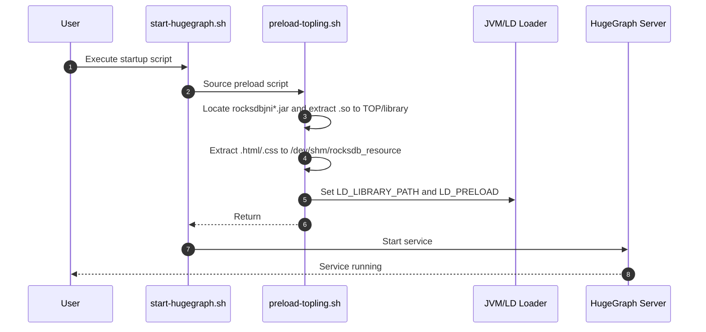
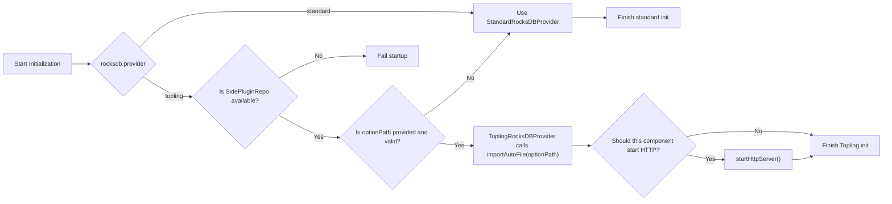

# Design of ToplingDB

## Overview

HugeGraph ToplingDB aims to enhance compatibility with ToplingDB, providing users with an additional storage engine option that improves performance, functionality, and usability.

## Design Goals

* **Dynamic Configuration**: Support flexible configuration of RocksDB parameters via YAML files, replacing hardcoded values to improve maintainability and adaptability.
* **Strong Compatibility**: Maintain full compatibility with the RocksDB API, ensuring seamless migration and integration with existing RocksDB code and data.
* **Visual Monitoring**: Provide a Web Server interface for real-time visibility into storage engine status and configuration, enhancing observability.
* **Simplified Deployment**: Automatically load dynamic libraries from JAR packages without requiring manual `LD_PRELOAD` setup or complex startup procedures, lowering the barrier for users.

## Architecture Diagram

### HugeGraph Startup Script Logic

Steps ❷ ~ ❻ in the diagram below illustrate the preload logic added to support ToplingDB.

From the user's perspective, startup remains unchanged—simply execute `start-hugegraph.sh`.



### RocksDB Startup Logic

HugeGraph routes the main RocksDB open/close paths through `RocksDBProviderLoader`.
Providers are discovered via Java SPI, but the active provider is selected explicitly by
`rocksdb.provider`. `standard` uses vanilla RocksDB; `topling` requires
`org.rocksdb.SidePluginRepo` to be available at runtime.

```mermaid
sequenceDiagram
  autonumber
  participant Store as HugeGraph Server/PD/Store
  participant Config as HugeConfig
  participant Loader as RocksDBProviderLoader
  participant Provider as Configured Provider
  participant Repo as Repo Instance
  participant Rocks as RocksDB

  Store->>Config: Read PROVIDER / OPTION_PATH / OPEN_HTTP
  Store->>Loader: selectProviderIfNeeded(provider)
  Store->>Loader: openRocksDB(..., optionPath, openHttp)
  Loader->>Provider: openRocksDB(...)
  alt provider is standard
    Provider->>Rocks: RocksDB.open(...)
  else provider is topling and optionPath valid
    Provider->>Repo: Reflectively create SidePluginRepo
    Provider->>Repo: importAutoFile(optionPath)
    Provider->>Repo: openDB(JSON descriptor)
    opt Server openHttp is true and instance is GRAPH_STORE
      Provider->>Repo: startHttpServer()
    end
  else provider is topling but optionPath pre-validation fails
    Provider->>Rocks: RocksDB.open(...)
  end
  Loader-->>Store: Return RocksDB instance
  note over Store,Loader: On shutdown, close through the active provider; Topling closes Repo when present.
```

## Involved Modules

### ToplingDB JAR and Maven Setup

There are two ways to obtain the JAR package:

1. Pull from GitHub repository
2. Build manually and install to Maven

#### Pull JAR from GitHub Repository

Since ToplingDB is not published to Maven Central, the JAR can only be obtained from GitHub Actions releases:  
[JAR Package](https://github.com/hugegraph/toplingdb/packages/2550860)

Add GitHub repository configuration to your Maven `settings.xml`:

```xml
<!-- Configure GitHub account information -->
<!-- The <server> section is used to configure authentication for GitHub Packages -->
<servers>
   <server>
       <id>github</id>
       <username>YOUR_GITHUB_ACTOR</username>
       <!-- Ensure that YOUR_GITHUB_TOKEN has at least the read:packages permission -->
       <password>YOUR_GITHUB_TOKEN</password>
   </server>
</servers>

<profiles>
   <profile>
        <id>...</id>
       <repositories>
           ...
           <!-- The repository id here must match the server id defined above -->
           <repository>
               <id>github</id>
               <url>https://maven.pkg.github.com/hugegraph/toplingdb</url>
               <snapshots>
                   <enabled>true</enabled>
               </snapshots>
           </repository>
       </repositories>
   </profile>
</profiles>
```

Also, update the `rocksdbjni` version in `hugegraph-server/hugegraph-rocksdb/pom.xml` from `7.2.2` to `8.10.2-SNAPSHOT` to match the GitHub release:

```xml
<dependency>
    <groupId>org.rocksdb</groupId>
    <artifactId>rocksdbjni</artifactId>
    <version>8.10.2-SNAPSHOT</version>
</dependency>
```

#### Build ToplingDB JAR Manually

Clone [ToplingDB](https://github.com/topling/toplingdb) and run the following commands:

```bash
# Build shared library
make -j$(nproc) DEBUG_LEVEL=0 shared_lib
# Install shared library
sudo make install-shared PREFIX=/opt DEBUG_LEVEL=0
# Package JAR
make rocksdbjava -j$(nproc) DEBUG_LEVEL=0 STRIP_DEBUG_INFO=1 ROCKSDB_JAR_WITH_DYNAMIC_LIBS=1

# Set JAVA_HOME (especially for root)
export JAVA_HOME=/usr/lib/jvm/jre-openjdk-yourpath
# Install librocksdbjni dynamic library
sudo make -j install-jni PREFIX=/opt DEBUG_LEVEL=0 STRIP_DEBUG_INFO=1
# Install JAR to local Maven repository
cd java/target
cp rocksdbjni-8.10.2-linux64.jar rocksdbjni-8.10.2-SNAPSHOT-linux64.jar
mvn install:install-file -Dfile=rocksdbjni-8.10.2-SNAPSHOT-linux64.jar \
    -DgroupId=org.rocksdb -DartifactId=rocksdbjni \
    -Dversion=8.10.2-SNAPSHOT -Dpackaging=jar
```

### Preloading Dynamic Libraries and Static Resources

ToplingDB uses thread-local storage (TLS), requiring dynamic libraries to be preloaded via `LD_PRELOAD`.

Additionally, the Web Server needs static resources to render the visualization interface.

To support this, the `preload-topling.sh` script was added to preload ToplingDB dynamic libraries and Web Server resources.

Main tasks of `preload-topling.sh`:

- Extract `.so` libraries and Web resources (HTML/CSS) from `rocksdbjni*.jar`
- Set `LD_LIBRARY_PATH` and `LD_PRELOAD` environment variables
- Handle `libaio` compatibility issues on Ubuntu 24.04+

Both `init-hugegraph.sh` and `start-hugegraph.sh` now invoke `preload-topling.sh`, so users don’t need to worry about preload details.

### HugeGraph Configuration Options for RocksDB

Three RocksDB provider options were added: `provider` selects standard RocksDB or ToplingDB,
`option_path` points to the YAML file, and `open_http` enables the Web Server.

```properties
# rocksdb backend config
#rocksdb.data_path=/path/to/disk
#rocksdb.wal_path=/path/to/disk
#rocksdb.provider=topling
#rocksdb.option_path=./conf/graphs/rocksdb_server.yaml
#rocksdb.open_http=true
```

Java-side parsing and default values:

```java
public static final ConfigOption<String> PROVIDER =
        new ConfigOption<>(
                "rocksdb.provider",
                "The RocksDB engine provider. 'standard' for vanilla RocksDB, "
                + "'topling' for ToplingDB (requires addon installation).",
                allowValues("standard", "topling"),
                "standard"
        );

public static final ConfigOption<String> OPTION_PATH =
        new ConfigOption<>(
                "rocksdb.option_path",
                "The YAML file for configuring Topling/RocksDB parameters",
                null,
                ""
        );    

public static final ConfigOption<Boolean> OPEN_HTTP =
        new ConfigOption<>(
                "rocksdb.open_http",
                "Whether to start Topling's HTTP service",
                disallowEmpty(),
                false
        );
```

### ToplingDB Startup Logic

When `rocksdb.provider=topling`, `option_path` is configured, pre-validation passes, and the JAR
contains ToplingDB APIs, HugeGraph will load the YAML file and start ToplingDB. If
`rocksdb.provider=standard`, HugeGraph uses standard RocksDB.

For HugeGraph Server, the Web Server is only enabled for the `GRAPH_STORE` instance. PD and
Store pass their component-level HTTP flag to the provider.



## Design Decisions and Rationale

1. **Why does HugeGraph Server only start the Web Server for GRAPH_STORE?**
    - All graph data is stored in GRAPH_STORE, and performance tuning and observability are primarily focused on this instance.
