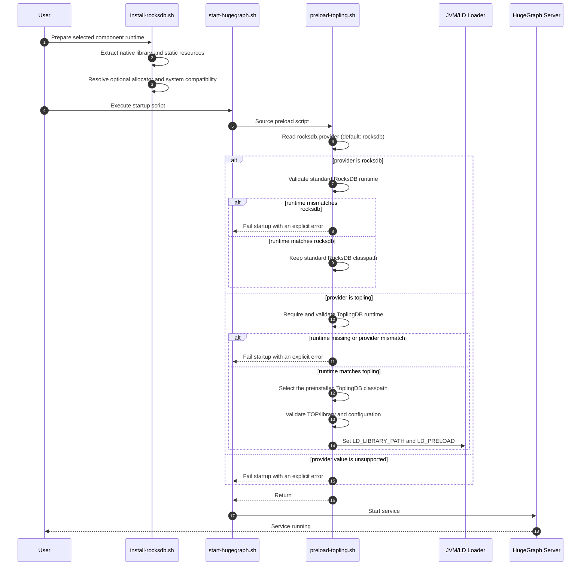
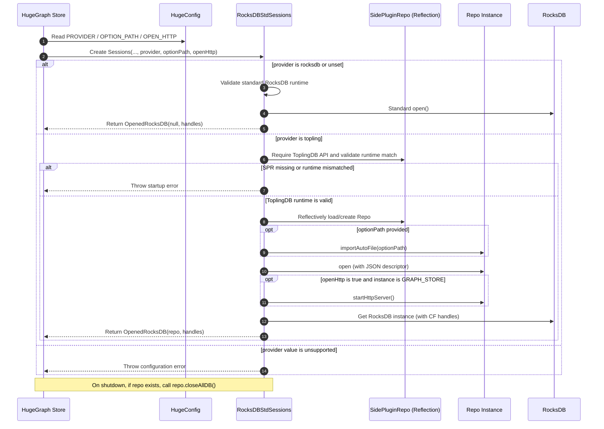
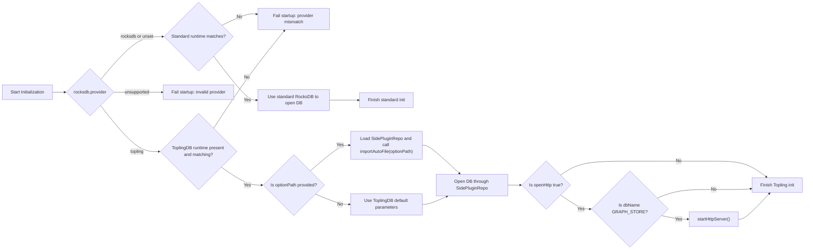
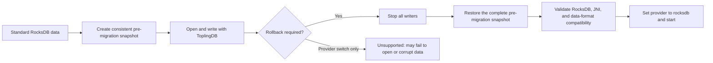

# Design of ToplingDB

## Overview

HugeGraph ToplingDB aims to enhance compatibility with ToplingDB, providing users with an additional storage engine option that improves performance, functionality, and usability.

## Design Goals

* **Dynamic Configuration**: Support flexible configuration of RocksDB parameters via YAML files, replacing hardcoded values to improve maintainability and adaptability.
* **API Compatibility**: Maintain compatibility with the RocksDB API. API
  compatibility does not imply that data written with ToplingDB-specific
  options can be reopened safely by standard RocksDB.
* **Visual Monitoring**: Provide a Web Server interface for real-time visibility into storage engine status and configuration, enhancing observability.
* **Immutable Runtime Selection**: Prepare JARs, native libraries, and static
  resources during packaging or installation. Service startup only validates
  and selects the prepared runtime.

## Architecture Diagram

### HugeGraph Startup Script Logic

The diagram below separates mutable runtime preparation from read-only service
startup. `install-rocksdb.sh` must run after the component distribution is
assembled and before ToplingDB is selected.

From the user's perspective, startup remains unchanged—simply execute `start-hugegraph.sh`.
The script reads `rocksdb.provider` before preparing any ToplingDB resources. The
default value is `rocksdb`; ToplingDB is never selected from `option_path` or from
classpath detection alone.



### RocksDB Startup Logic

Select the storage engine exclusively from `rocksdb.provider`. Reflection is used
only to validate and invoke the explicitly selected ToplingDB runtime. A missing
runtime, an unsupported provider, or a provider/runtime mismatch is a startup
error; HugeGraph does not silently fall back to another engine.



## Involved Modules

### ToplingDB JAR and Maven Setup

There are two ways to obtain the JAR package:

1. Pull from GitHub repository
2. Build manually and install to Maven

#### Pull JAR from GitHub Repository

Since ToplingDB is not published to Maven Central, the JAR can only be obtained from GitHub Actions releases:  
[JAR Package](https://github.com/hugegraph/toplingdb/packages/2550860)

Add GitHub repository configuration to your Maven `settings.xml`:

```xml
<!-- Configure GitHub account information -->
<!-- The <server> section is used to configure authentication for GitHub Packages -->
<servers>
   <server>
       <id>github</id>
       <username>YOUR_GITHUB_ACTOR</username>
       <!-- Ensure that YOUR_GITHUB_TOKEN has at least the read:packages permission -->
       <password>YOUR_GITHUB_TOKEN</password>
   </server>
</servers>

<profiles>
   <profile>
        <id>...</id>
       <repositories>
           ...
           <!-- The repository id here must match the server id defined above -->
           <repository>
               <id>github</id>
               <url>https://maven.pkg.github.com/hugegraph/toplingdb</url>
               <snapshots>
                   <enabled>true</enabled>
               </snapshots>
           </repository>
       </repositories>
   </profile>
</profiles>
```

Also, update the `rocksdbjni` version in `hugegraph-server/hugegraph-rocksdb/pom.xml` from `7.2.2` to `8.10.2-SNAPSHOT` to match the GitHub release:

```xml
<dependency>
    <groupId>org.rocksdb</groupId>
    <artifactId>rocksdbjni</artifactId>
    <version>8.10.2-SNAPSHOT</version>
</dependency>
```

#### Build ToplingDB JAR Manually

Clone [ToplingDB](https://github.com/topling/toplingdb) and run the following commands:

```bash
# Build shared library
make -j$(nproc) DEBUG_LEVEL=0 shared_lib
# Install shared library
sudo make install-shared PREFIX=/opt DEBUG_LEVEL=0
# Package JAR
make rocksdbjava -j$(nproc) DEBUG_LEVEL=0 STRIP_DEBUG_INFO=1 ROCKSDB_JAR_WITH_DYNAMIC_LIBS=1

# Set JAVA_HOME (especially for root)
export JAVA_HOME=/usr/lib/jvm/jre-openjdk-yourpath
# Install librocksdbjni dynamic library
sudo make -j install-jni PREFIX=/opt DEBUG_LEVEL=0 STRIP_DEBUG_INFO=1
# Install JAR to local Maven repository
cd java/target
cp rocksdbjni-8.10.2-linux64.jar rocksdbjni-8.10.2-SNAPSHOT-linux64.jar
mvn install:install-file -Dfile=rocksdbjni-8.10.2-SNAPSHOT-linux64.jar \
    -DgroupId=org.rocksdb -DartifactId=rocksdbjni \
    -Dversion=8.10.2-SNAPSHOT -Dpackaging=jar
```

### Preloading Dynamic Libraries and Static Resources

ToplingDB uses thread-local storage (TLS), requiring dynamic libraries to be preloaded via `LD_PRELOAD`.

Additionally, the Web Server needs static resources to render the visualization interface.

`install-rocksdb.sh` prepares ToplingDB dynamic libraries and Web resources.
`preload-topling.sh` performs read-only validation and exports the selected
classpath and library paths.

Installation tasks:

- Extract `.so` libraries and Web resources (HTML/CSS) from `rocksdbjni*.jar`
- Handle `libaio` compatibility issues on Ubuntu 24.04+
- Optionally prepare jemalloc

Startup tasks are limited to strict provider parsing, immutable runtime
selection, dependency validation, and exporting `LD_LIBRARY_PATH`, `LD_PRELOAD`,
and the Server classpath. Startup never downloads files, extracts archives,
replaces JARs, invokes `sudo`, or modifies system directories. Missing prepared
resources are a startup error with an instruction to run the installation step.

### HugeGraph Configuration Options for RocksDB

Three configuration options define engine selection and ToplingDB behavior.
`rocksdb.provider` is the sole engine selector. `rocksdb.option_path` only points
to a parameter file and never enables ToplingDB by itself.

```properties
# rocksdb backend config
#rocksdb.data_path=/path/to/disk
#rocksdb.wal_path=/path/to/disk
#rocksdb.provider=rocksdb
# To enable ToplingDB explicitly:
#rocksdb.provider=topling
#rocksdb.option_path=./conf/graphs/rocksdb_plus.yaml
#rocksdb.open_http=true
```

Java-side parsing and default values:

```java
public static final ConfigOption<String> PROVIDER =
        new ConfigOption<>(
                "rocksdb.provider",
                "The RocksDB runtime provider: rocksdb or topling",
                allowValues("rocksdb", "topling"),
                "rocksdb"
        );

public static final ConfigOption<String> OPTION_PATH =
        new ConfigOption<>(
                "rocksdb.option_path",
                "The ToplingDB YAML parameter file; this does not select a provider",
                null,
                ""
        );

public static final ConfigOption<Boolean> OPEN_HTTP =
        new ConfigOption<>(
                "rocksdb.open_http",
                "Whether to start Topling's HTTP service",
                disallowEmpty(),
                false
        );
```

### ToplingDB Startup Logic

HugeGraph selects ToplingDB only when `rocksdb.provider=topling`. In that mode,
the ToplingDB runtime must be present and must match the selected provider or
initialization fails immediately. When the provider is `rocksdb` or omitted,
HugeGraph uses standard RocksDB. `option_path` is consulted only after ToplingDB
has been selected and validated.

To keep port configuration simple, the Web Server is only enabled for the `GRAPH_STORE` instance.



### Data Compatibility, Backup, and Rollback

Changing `rocksdb.provider` selects the runtime used for the next open; it is
not a data migration or rollback operation. The shipped ToplingDB option files
currently enable ToplingDB-specific behavior, including:

```yaml
convert_to_sst: kFileMmap
memtable_as_log_index: true
```

After ToplingDB has opened and written a database with these options, its WAL,
SST, or related metadata may no longer be safely consumable by standard
RocksDB. Therefore changing `rocksdb.provider` from `topling` to `rocksdb` and
restarting is unsupported as a rollback procedure. HugeGraph must not describe
a successful JAR restoration or provider change as a successful data rollback.



The pre-migration snapshot must be a RocksDB-consistent snapshot created with
RocksDB Checkpoint or BackupEngine, or a complete copy of the data directory
while the owning process is stopped. It must include every file required for
recovery, including SST files, `CURRENT`, `MANIFEST-*`, `OPTIONS-*`, column
family metadata, and the required WAL files. Copying or restoring only SST and
MANIFEST files is not sufficient and can produce a mixed database state.

Rollback procedure:

1. Before enabling ToplingDB, stop writes and create a complete consistent
   snapshot for every affected Server, PD, and Store database.
2. Record and verify the standard RocksDB/JNI versions and snapshot format.
3. To roll back, stop the component and restore the entire snapshot into an
   empty data directory; do not merge it with files written by ToplingDB.
4. Restore the matching standard JNI/runtime, set `rocksdb.provider=rocksdb`,
   and verify the database before accepting traffic.

Online or in-place gray switching is not supported by this design. It may only
be documented as supported after an automated compatibility test proves the
complete sequence below for every supported version and option set:

```text
standard create/write -> ToplingDB open/write -> restart ToplingDB
                      -> standard reopen/read/write verification
```

Until that test exists and passes, deployment tooling and documentation must
require snapshot restoration when returning to standard RocksDB after any
ToplingDB write.

## Design Decisions and Rationale

1. **Why is the Web Server only started for GRAPH_STORE?**
    - All graph data is stored in GRAPH_STORE, and performance tuning and observability are primarily focused on this instance.
