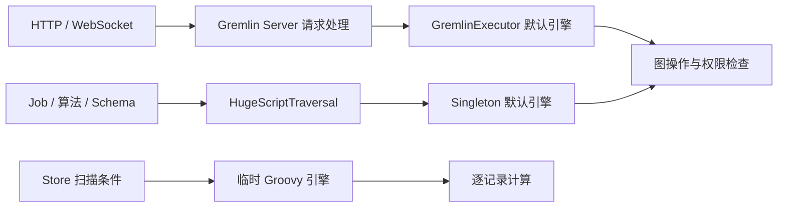
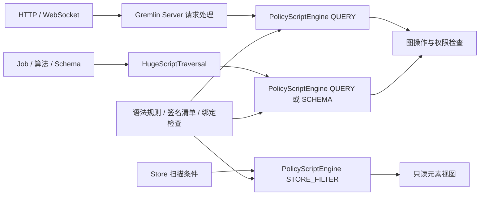
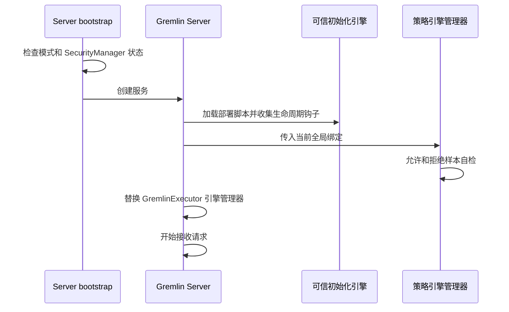

# HugeGraph Groovy 脚本安全加固设计

| 项目 | 内容 |
|---|---|
| 实施基线 | 纯升级分支 `task/tp381-apache-integration-20260907`，提交 `cbb1d72e817994b1c74f4097625e2e22dc912d7b` |
| 运行环境 | TinkerPop 3.8.1、Java 17、Groovy 4.0.25 |
| 状态 | 已接入策略引擎，默认保持 `legacy`；`policy-only` 为实验模式 |
| 目标读者 | Server / Store 开发者、安全评审者和部署人员 |
| 发布范围 | 独立的 Groovy 安全增量，保持 Groovy，不切换 GremlinLang，不自动纳入 Apache HugeGraph 1.8 的升级发布要求 |

## 1. 原有执行路径

HugeGraph 使用 Groovy 组合查询、处理结果，也用它执行后台任务、初始化图结构和筛选 Store 扫描记录。基线中有三条独立的脚本执行路径。Gremlin Server 负责 HTTP / WebSocket 请求的认证、调度、事务和响应，内部脚本通过 `HugeScriptTraversal` 获取另一个引擎，Store 则自行创建 Groovy 引擎。

下图展示基线中尚未统一的编译入口。

`HugeSecurityManager` 会在部分文件、网络、进程等 JVM 操作发生时检查调用来源。它主要识别 Gremlin 和任务工作线程中的特定调用栈，不能据此认为每个进程和每条脚本路径都已有同等保护。Store 的基线启动流程没有安装这个机制。

## 2. 实现后的执行路径

新增的 `PolicyScriptEngine` 负责受限编译、输入检查和编译缓存。它使用 Groovy 静态编译，无法证明调用符合规则时拒绝执行。Server 保留原请求处理器、认证、调度、序列化和事务流程，在部署者的初始化脚本执行完毕后替换用户请求使用的引擎管理器。

内部调用和 Store 使用同一组编译组件，分别选择适合入口的能力集合。本文把这种集合称为 profile。

| Profile | 实际入口 | 可用能力 |
|---|---|---|
| `QUERY` | HTTP / WebSocket 文本脚本、GremlinJob、通过 HugeScriptTraversal 执行的算法脚本 | 查询和图数据写入，变量、条件、循环、集合及选定闭包 |
| `SCHEMA` | GraphManager.prepareSchema | QUERY 能力及属性、顶点类型、边类型和索引的创建接口 |
| `STORE_FILTER` | GraphStoreIterator | 读取当前元素的数据视图并返回 Boolean，禁止循环、闭包和集合修改 |

Profile 由 Java 入口选定，客户端不能请求管理员或可信编译模式。`graph.clearBackend()`、任意 Java 包访问和启动管理接口均不属于允许能力。

## 3. 三种部署模式

| 模式 | 新策略 | HugeSecurityManager | 适用范围 |
|---|---|---|---|
| `legacy` | 关闭 | 保留基线配置 | 默认模式，保持原有脚本兼容性 |
| `combined` | 开启 | 保留基线配置 | 同时验证编译限制和已有运行时检查 |
| `policy-only` | 开启 | 必须未安装 | 实验模式，用于独立验证策略和测量性能 |

通过 JVM 参数 `-Dhugegraph.script.security.mode=combined` 选择模式。参数只在进程启动时读取，改变后需要重启。Server 和 Store 分别配置，不能只修改 Server 就认为 Store 过滤入口也已启用。

`combined` 不会替原本关闭 SecurityManager 的部署自动打开它。Server 继续遵循现有启动参数，Store 继续保持基线安装状态。启用策略的进程会输出模式、策略版本和实际安装状态。

`policy-only` 下，Server bootstrap 跳过安装 HugeSecurityManager，但保留原有 DNS 安全属性检查。若 JVM 已由其他启动参数或 agent 安装 SecurityManager，则启动失败，不尝试卸载。非法模式也会启动失败。所有模式继续使用已有身份认证和图权限检查。

## 4. 启动顺序与可信脚本

启动脚本属于部署者维护的代码，可以初始化图、遍历源和生命周期钩子。它们使用原引擎执行，不接受请求传入的文件路径。新引擎接管后不开放这些初始化能力。

TinkerPop 3.8.1 没有在这里提供现成的管理器替换接口，因此接入点使用项目已有的反射工具替换 `gremlinScriptEngineManager`。真实 HTTP / WebSocket 测试覆盖这个位置。字段或调用顺序变化会使启动失败，不能退回默认引擎继续服务。

首版接受标准 `WsAndHttpChannelizer` 和单一 `gremlin-groovy` 引擎配置。其他 channelizer 或额外语言配置会被拒绝。Store 启动时也运行允许及拒绝样本自检。

## 5. 编译与方法规则

编译器首先禁止用户定义类、方法和注解，并禁用 classpath 中注册的全局 AST transform，包括 Grab 转换。随后使用 `CompileStatic` 和 Java 类型检查扩展校验方法调用，最后检查属性、类型转换和其他可能生成隐式调用的表达式。

| 内容 | 策略行为 |
|---|---|
| 方法调用 | 按声明类型、方法名和参数类型匹配固定清单，不按包名前缀放行 |
| 类值、反射、类加载、二次编译 | 拒绝 Class 值、getClass、Class.forName、evaluate 和相关入口 |
| 元编程 | 拒绝 metaClass、binding、闭包 owner / delegate / thisObject 和动态方法名 |
| 隐式调用 | 拒绝 GString、方法引用、用户构造器、`as` 转换及未批准的声明类型 |
| 正则表达式 | 拒绝正则操作符及 TextP 正则谓词 |
| 业务闭包 | QUERY / SCHEMA 允许已批准的集合、遍历回调，闭包体仍接受相同检查 |
| Store 表达式 | 只读，无循环、无闭包，结果必须为 Boolean |

三个 `*-methods.txt` 资源文件是该版本的方法签名清单。启动创建策略时会校验依赖中实际签名与清单是否一致。依赖新增或删除重载时，不能自动扩展脚本权限，必须随代码显式更新清单和测试。

这组限制保留了常用 Groovy 组合能力，但不提供任意 Groovy 程序的兼容性。例如空列表参与数值闭包时可能需要写成 `List<Integer> values = []`，让静态编译器获得元素类型。

## 6. 绑定、缓存和返回值

bindings 是传给脚本的变量。客户端数据接受限定的标量和容器，容器递归校验并复制，拒绝循环引用、自定义容器及隐藏的 Class、Closure、引擎或服务对象。图、Schema 和任务上下文只由服务端注入。

图绑定识别 HugeGraph 实现及鉴权代理。遍历源识别标准 GraphTraversalSource 和 HugeGraphAuthProxy 的遍历源代理，静态类型统一为公开接口，运行时仍调用代理执行权限检查。

| 项目 | 实现 |
|---|---|
| 缓存内容 | 编译类和所属类加载器，不保存 Script 实例、绑定值、用户身份或执行结果 |
| 缓存区分 | 源码和绑定类型组成键；不同 profile 使用不同引擎，策略及 classpath 随进程固定 |
| 每次执行 | 新建 Script 和独立 Binding，使用当前入口提供的图及用户上下文 |
| 缓存上限 | 每个引擎 256 项，空闲 30 分钟过期；Server 和 Store 只创建有限的 profile 实例 |
| 预编译条件 | Store 复用编译结果，逐记录执行时仍检查绑定类型，不重复构造源码缓存键 |
| 关闭 | 关闭引擎后拒绝执行，清理缓存和类加载器；编译线程空闲 30 秒后退出 |

结果不能携带 Class、闭包、引擎上下文、图对象或遍历源，也会检查集合、Map、Optional、Path 和属性值中的嵌套对象。返回未执行的遍历时，在末尾增加结果检查步骤，避免把执行对象藏在 `g.inject(...)` 的惰性结果中。已经开始消费的遍历不能作为剩余遍历返回；调用方可以显式取出所需结果。

同一份编译缓存不保留旧用户权限。切换用户后，每次图操作继续经过当前鉴权代理。动态图绑定仍来自原 GraphManager，删除和替换时不把图对象留在编译缓存中。

## 7. 入口兼容变化

| 用法 | legacy | combined / policy-only |
|---|---|---|
| 普通 HTTP / WebSocket Groovy 查询 | 原行为 | 保持协议和结果流程，脚本必须通过策略 |
| 变量、条件、数值循环、常用集合闭包 | 原行为 | 在允许的类型和方法范围内支持 |
| Session 请求 | 原行为 | 拒绝，防止 Session 自建未受控引擎 |
| 普通 Gremlin bytecode | 原行为 | 接受协议解码后的 Bytecode 对象，先检查 step、参数和谓词，再交给原 traversal processor |
| Bytecode 中的脚本 lambda | 原行为 | 拒绝；文本 Groovy 中经过校验的闭包仍可用 |
| Bytecode source options、io、call 等扩展入口 | 原行为 | 拒绝 |
| QUERY 中创建 Schema 或操作系统资源 | 原行为及原安全检查 | 编译拒绝 |
| 用户类、方法定义、注解、跨请求全局函数 | 原行为 | 拒绝 |
| Store 元素对象 | 原 BaseElement | 仅暴露 id、label、property 和 properties 的数据视图 |

Store 的 `element.id()` 返回字符串，`element.label()` 返回名称，`element.property('age')` 返回属性值，日期转换为毫秒值，Blob 转换为字节数据。旧条件依赖 BaseElement、BaseProperty 或 Id 方法时，需要改为这些访问器。非 Boolean 返回值会使扫描失败。

## 8. 资源限制和失败行为

| 项目 | 固定限制或行为 |
|---|---|
| 源码 | UTF-8 不超过 64 KiB |
| 绑定 | 不超过 256 项，嵌套深度 16，结构节点 4096，数据预算 64 KiB |
| 编译 | 每个进程 2 个工作线程，队列 32；相同缓存键合并编译请求 |
| 编译等待 | 最多 5 秒；超时后仍占用原工作槽，不启动替代线程规避上限 |
| 执行 | 循环及闭包检查中断与 30 秒期限；更短的 Server 超时继续有效 |
| 请求超时参数 | 不能提高进程规定的上限；拒绝 TinkerPop 可识别的源码 timeout 覆盖文本，包括字符串中的相同文本 |
| 结果结构 | 深度 64，展开节点 100000，每个节点检查取消；共享子结构按实际展开量计算 |
| 中间对象 | 没有 JVM 内的硬内存隔离，保留已有结果批次和容量限制 |

| 失败位置 | 可观察行为 |
|---|---|
| Session、bytecode 或请求参数检查 | Gremlin 原有 INVALID_REQUEST_ARGUMENTS 响应，保留 request ID |
| 编译、过载、超时、执行错误 | ScriptException 携带稳定的 SCRIPT_* 分类，由原入口返回失败 |
| GremlinJob 执行或关闭失败 | 新模式回滚当前图事务；成功完成后提交 |
| Store 条件编译失败 | 在首次读取记录前关闭迭代器并拒绝请求 |
| Store 条件求值失败 | 终止扫描，关闭迭代器，以 gRPC 错误结束，不报告成功完成 |

编译和运行错误不会自动转到旧引擎重试。新引擎的异常不携带完整脚本和绑定值；原 Gremlin Server 请求日志仍由原日志配置控制。流式响应已经发出的记录无法收回，调用方必须以最终错误判断整次扫描失败。Schema、任务调度等已提交操作不承诺跨服务原子回滚。

## 9. 可观测性与 HugeSecurityManager

每个 profile 注册一个本地 JMX 对象，名称为 `org.apache.hugegraph:type=ScriptPolicy,profile=QUERY`，其余 profile 使用对应名称。指标包括活动引擎数、缓存命中与未命中、编译次数、编译及排队耗时、求值次数、拒绝、编译超时和执行超时计数。关闭引擎后，其实例统计不再进入活动实例汇总。JMX 沿用现有 JVM 管理访问配置，不新开远程端口。

HugeSecurityManager 的识别清单增加了 PolicyScriptEngine 及生成的脚本和闭包，使新引擎的执行路径能够接受已有运行时检查。没有修改原权限条件和框架例外，也没有实施调用栈快照复用优化。

| 原运行时检查类别 | 新策略对应限制 | 仍存在的边界 |
|---|---|---|
| 文件、网络、进程、退出、线程、native library | 不开放相应类型、构造器和方法，禁止动态加载及间接调用入口 | 白名单方法内部仍可能调用 JVM 或后端资源 |
| 系统属性、SecurityManager 更换、类加载 | 拒绝相关方法、Class 值和反射能力 | 部署脚本、插件和依赖属于可信计算范围 |
| 图数据权限 | 保留原鉴权代理和身份传递 | 编译允许不代表当前用户具有图权限 |
| CPU、内存和阻塞操作 | 有界输入、编译和缓存，协作取消 | 同 JVM 策略不能提供硬隔离 |

`policy-only` 的实现和测试不能证明它已全面替代 HugeSecurityManager。该模式仍以实验状态交付，正式部署资格取决于独立安全评审及目标工作负载验证。

## 10. 验证与回滚

编译测试覆盖 AST 转换时序、注解、间接调用和绑定隔离。独立 JVM 测试覆盖三种 Server 模式的 HTTP / WebSocket / bytecode，另有 Schema、任务事务、缓存下的权限切换和 Store 失败传播测试。实际结果见同目录的验证记录。

性能对照使用相同版本和产物，分别观察原引擎、新引擎以及 SecurityManager 安装状态。引擎微基准只能说明编译和求值成本，不能代替 RocksDB / HStore、鉴权、网络和真实业务查询的整体吞吐验收。历史 Java 11 / 17 benchmark 不用于推断本方案收益。

回滚时修改 JVM 模式并重启。`policy-only` 切回 `combined` 后恢复该部署基线中的 SecurityManager 配置，并保留新规则；切回 `legacy` 则恢复原脚本兼容行为。回滚不改变存储数据格式，也不会撤销已经提交的业务写入。

## 11. 验收范围

实现接入、功能回归、业务性能和独立模式安全资格分别记录。实验模式的交付不取消原设计中的验收条件。

| 验收类别 | 判断依据 |
|---|---|
| 业务兼容 | 常用遍历、读写、控制流、集合、闭包及 GraphSON 结果与基线一致；覆盖 RocksDB 和 HStore |
| 编译与调用 | AST 转换在副作用前拒绝，属性、操作符、扩展方法、回调及返回对象均受检查 |
| 权限与缓存 | 非管理员、只读、撤权、多图别名、动态图创建删除、异步身份及 profile 切换不复用旧权限 |
| 入口与失败 | HTTP、WS、Job、内部算法、Schema、Store 和 bytecode 均有证据；已发出部分结果的扫描仍以错误结束 |
| 资源与停止 | 冷编译洪峰、取消、缓存淘汰及停止后，没有持续增长的线程、类加载器或缓存 |
| 业务性能 | 独立纯升级基线、新代码 legacy、combined 和 policy-only 使用同样的真实负载及鉴权，至少五轮有效测量 |
| 性能预算 | 热查询吞吐下降不超过 5%，P95 增幅不超过 10%；冷编译单列，不以微基准代替判断 |
| 独立防护资格 | 逐项对应 HugeSecurityManager 原保护条件，记录替代机制、无 SecurityManager 的独立证据及适用部署 |

调用栈复用属于可单独实施和测量的优化，本次没有修改它。当前验证记录明确列出已测范围和未验证范围；未验证项不会因实现完成或 CI 通过而自动视为通过。

## 12. 源码依据

- [纯升级实施基线](https://github.com/hugegraph/hugegraph/tree/cbb1d72e817994b1c74f4097625e2e22dc912d7b)
- [本次实现分支](https://github.com/hugegraph/hugegraph/tree/codex/groovy-policy-hardening)
- [TinkerPop 3.8.1 GremlinExecutor](https://github.com/apache/tinkerpop/blob/3.8.1/gremlin-groovy/src/main/java/org/apache/tinkerpop/gremlin/groovy/engine/GremlinExecutor.java)
- [TinkerPop 3.8.1 ServerGremlinExecutor](https://github.com/apache/tinkerpop/blob/3.8.1/gremlin-server/src/main/java/org/apache/tinkerpop/gremlin/server/util/ServerGremlinExecutor.java)
- [Groovy 4.0.25 类型检查扩展](https://github.com/apache/groovy/blob/GROOVY_4_0_25/src/main/java/org/codehaus/groovy/transform/stc/TypeCheckingExtension.java)
