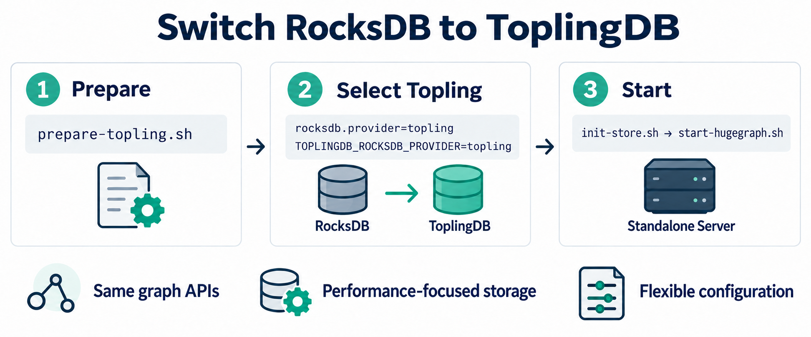

# Storage lifecycle, recovery and runtime compatibility

This guide covers Store RPC ownership and shutdown coordination, standalone RocksDB
snapshot recovery, and storage runtime upgrades. Use it when changing request cleanup,
deploying storage components, recovering an interrupted restore, or upgrading JNI.

Store RPC lifecycle and standalone RocksDB recovery are separate contracts. The
standalone recovery protocol does not provide HStore multi-partition recovery or an
atomic restore across all databases in a graph.

## Guide map

- [RPC and Scan ownership](#rpc-and-scan-ownership): final batches, half-close,
  cancellation, iterator cleanup and callback dispatch.
- [Shutdown coordination](#shutdown-coordination): admission, worker drain and
  application callbacks before database teardown.
- [Standalone snapshot recovery](#standalone-snapshot-recovery): pending records,
  checkpoint identity, WAL paths and safe retry.
- [Storage provider selection and ToplingDB](#storage-provider-selection-and-toplingdb):
  JNI preparation, provider configuration and persistent paths.
- [Runtime compatibility and upgrades](#runtime-compatibility-and-upgrades): backup,
  JNI/JRaft compatibility, the compatibility runner and monitoring changes.

## RPC and Scan ownership

### Half-close, feedback and cancellation

Request half-close is separate from transport cancellation.
An aggregate query finishes work already supported by feedback credit after half-close;
a later transport cancellation or deadline still cancels its workers. Graph partition
scans deliver their permitted pages and final batch, or return an explicit error when
half-close leaves insufficient feedback credit. Batch-scan RPCs accept one initial
query.

### Client response and iterator ownership

Response parsing runs outside the client state lock. Accepted final batches remain
visible across response completion; errors and iterator close discard unpublished data.
Early query close cancels the transport without waiting for a blocked request send.
Normal half-close stays serialized with sends. Closing a composite iterator closes all
started children once. A closed multi-partition iterator is terminal: later probes do
not reopen another partition, including after a child cleanup failure.

Accepting a response refreshes the watchdog before parsing starts. Completion preserves
an accepted batch while it is being parsed; cancellation and errors can discard it.
The state lock protects these transitions rather than response extraction.

### Server worker and cleanup ownership

Each scan/query owns its workers and iterators until cleanup finishes. Iterator cleanup
failures remain visible, including automatic native iterator close and empty-partition
selection. Final aggregate success is sent only after plan and iterator cleanup
succeeds.

Cancellation signals the currently owned reader before waiting for its iterator lock.
Publishing, interrupting and clearing that thread use the same ownership lock so a
reused executor thread is not mistaken for the cancelled reader. Half-close does not
interrupt the reader. Queued cancelled tasks still execute their cleanup/accounting
paths, and iterator close waits for an active read to leave the iterator.

Unary query and count requests share the query admission, worker and cleanup owner
registry. Count keeps partition work parallel on the service executor. Iterator cleanup
failure prevents successful completion and remains visible to request drain.

One-shot scans run on the gRPC caller thread. Transport cancellation and Store shutdown
signal that caller directly, so interruptible waits can exit without waiting for a
queued call-executor callback. Interruption is cooperative: a RocksDB native operation
does not guarantee that it will return on Java thread interruption. The call remains
registered until its read and iterator cleanup finish; cancellation does not permit
another thread to close a native iterator that is still in use.

### Callback executor configuration

The gRPC application callback queue is always unbounded (`Integer.MAX_VALUE`), matching
its existing default. `thread.pool.grpc.queue` remains accepted for configuration
compatibility but no longer limits this callback queue. Bounded callback dispatch can
reject cancellation or completion callbacks in gRPC 1.55.3, leaving request cleanup
registered after the transport has closed. `thread.pool.grpc.core` and `.max` still
configure the same executor; an unbounded queue normally keeps dispatch at the core
thread count. Bound expensive scan/query work and admission at their worker queues;
sustained overload can otherwise increase callback backlog and memory use.

## Shutdown coordination

RPC and Scan drain establishes completion of their request owners. It does not by itself
establish completion of unrelated background maintenance jobs.

The RPC boundary stops admission to every Store RPC before cancelling active scans and
queries. It runs queued request cleanup and waits for terminal application callbacks
before Spring destroys their databases. This reuses the same per-call owners; it does
not create a second shutdown registry. Interrupted cleanup waits and native teardown
preserve interruption without abandoning these owners.

The Store context-close listener stops RPC, scan and query admission, requests transport
shutdown, and drains scan/query workers before waiting for terminal gRPC callbacks and
scan cleanup. Queued cancelled scans still run their cleanup paths.

Shutdown terminates unfinished aggregate responses with `UNAVAILABLE`, rather than
reporting normal completion for a truncated result. Terminal delivery is serialized
with batch delivery and does not release the request's cleanup ownership: shutdown
still waits for the workers and iterators even if the response callback fails.

Transport termination alone is insufficient evidence that an application callback or
native iterator owner has finished. Preserve the application cleanup barrier when
changing the server framework, executor configuration or shutdown ordering.

Drain waits retain ownership until cleanup finishes and restore the shutdown thread's
interrupted status. They must not close databases under a worker solely because a wait
was interrupted. A blocked owner can keep shutdown waiting; investigate that owner
rather than bypassing the database lifetime guard.

The engine closes partition databases after their partition engines shut down, then
releases graph database and schema resources. Keep this ordering when modifying Raft or
database teardown. Request drain and database release have different responsibilities;
reuse their existing owners instead of adding a parallel registry.

## Standalone snapshot recovery

### Installation and pending metadata

Standalone RocksDB snapshot restore retains its source checkpoint until the replacement
is installed and reopened. Before changing data, it records the source checkpoint and
WAL location in a sibling `<data-path>.resume-pending` file, together with the restore
operation and checkpoint generation. After an I/O failure or process interruption, a
subsequent HugeGraph open retries the interrupted installation before native recovery.
Missing sources, incomplete metadata or a changed WAL configuration stop opening instead
of replaying uncertain data.

### Filesystem durability boundaries

On Linux, recovery synchronizes the marker parent directory before replacing live data
and after removing the marker, before consuming the checkpoint. A directory-sync failure
stops that step and preserves the checkpoint; after installation has succeeded, an
unlink-sync failure leaves the restored live data intact. Other platforms retain their
existing filesystem durability behavior. This marker ordering does not guarantee that
every copied data or WAL file survives a power loss.

### Publishing the pending record

Recovery metadata publication requires same-directory hard-link support in the data
directory's parent filesystem. The complete temporary record is written and forced
before its final name is published without overwriting an existing marker. A
pre-publication I/O or unsupported-link failure leaves live data and the checkpoint
untouched; resolve the filesystem or permission fault, reopen normally and reissue
restore. Existing damaged or old-format markers are still preserved and rejected.

### Preparing application work

Quiesce graph requests, background tasks and open query iterators before starting a
restore. The recovery lease coordinates database opens and file installation; it does
not drain active application work.

### Retrying an interrupted restore

Preserve the checkpoint, pending marker and configured paths after a failure. Restore
access or free space, then retry normal startup with the same runtime and configuration.
Do not delete the pending marker to bypass the guard. Successful native reopening clears
it and then attempts checkpoint cleanup, preserving the existing consume-on-success
behavior.

The normal retry sequence is:

1. Preserve the original checkpoint, pending record, WAL location and mount layout.
2. Correct the access, space or filesystem fault without changing their identities.
3. Release the remaining Store sessions with normal close calls when the failed restore
   has already closed the native handle.
4. Reopen with the same runtime and configuration so startup retries the recorded operation.
5. Allow successful native reopening to clear the record and perform checkpoint cleanup.

If native close itself failed, use the failure handling below instead of attempting a
competing open.

### Recovery ownership and native close failures

A sibling `<data-path>.resume-lock` serializes cooperating opens and restores. The OS
lock remains held through native close and reopen, and is released when the database
finally closes. The lock file remains on disk; its presence alone does not prove an
active owner. Do not delete it to force another opener through. Within one JVM,
physical-file ownership also covers path aliases. An unrelated database can still open
while another database is closing. A failed native or lock-descriptor close retains
recovery ownership and reports the failure; retrying close cannot bypass it. Preserve
the recovery files and stop the process before retrying startup after such a failure.
Older binaries and unrelated writers do not honor this protocol and must not access
these directories concurrently.

### Mount layout and physical path identity

Mount the parent data root, such as `rocksdb-data`, rather than an individual store
directory such as `data/g`. Java opening rejects a store that is itself a volume mount,
including same-filesystem bind mounts on Linux. Such aliases can hide the sibling
guards, and directory replacement cannot replace a mount point. This Java check is per
database: it does not promise a pre-JVM scan of every graph or that no sibling database
has initialized before another open fails. Keep mount layout unchanged throughout
startup and recovery. Checkpoint/live-data overlap and a checkpoint containing the WAL
directory are rejected by physical directory identity, including parent bind aliases;
separate path strings do not make overlapping trees safe. Recovery refuses the operation
if a required physical identity cannot be determined.

### WAL replacement and recovery scope

Independent WAL, WAL inside data, and data inside a WAL root use in-place log
replacement. Preserve WAL symlink configuration across retries. Local fault tests cover
interrupted operations and reopening; they do not establish power-cut durability. This
mechanism does not provide an atomic whole-graph restore or an HStore multi-partition
snapshot protocol.

### Checkpoint generation and identity

Each non-consuming restore creates a unique checkpoint directory. Pending recovery binds
the original directory and immutable SST filesystem identities, plus checkpoint metadata
and WAL contents, so replacing a checkpoint at the same path is rejected before data
replacement. Keep the original checkpoint in place: copying it elsewhere and back may
change its identity. Filesystems without file identities use content hashes instead.
Unrelated writers must not modify checkpoint files; this protocol does not protect
against malicious in-place changes to immutable SST files.

### WAL staging and retained material

WAL staging uses a sibling `<data-path>.resume-staging-<operation>` directory recorded
by the pending operation. Retired WAL remains there until successful native reopening;
repeated attempts reuse that same directory. Cleanup removes only the current
operation's directory, never all matching prefixes. Unknown staging directories and
markers from older formats remain preserved for diagnosis rather than being guessed or
silently upgraded.

### Store-level retry

After a Store-level restore failure closes its native owner, reopen the database to
retry the recorded pending operation. Calling restore again on the already closed Store
does not reopen it. Recovery retries the recorded unique checkpoint; it does not create
a new non-consuming copy.

### Non-consuming restore and temporary-copy cleanup

Non-consuming Store restore first creates all temporary checkpoints, then restores each
database. If either phase fails, it attempts to remove only the exact temporary copies
created by that invocation, including an unfinished checkpoint created before its path
could be returned. Cleanup requires the same database recovery ownership and a confirmed
absent pending marker. Any existing or unreadable marker preserves the copy and emits a
diagnostic; lock contention also preserves it. Original user checkpoints and unrelated
temporary directories are never part of this cleanup. This does not collect historical
orphan directories or copies left by a process killed before writing its pending marker.
Restore remains non-atomic across databases.

### Metadata integrity and runtime changes

Pending records include a SHA-256 checksum over all metadata property names and values,
excluding the checksum itself. Recovery verifies it before reconstructing any WAL alias,
then uses the filesystem's actual canonical WAL path to validate the destination. This
detects incomplete or changed metadata; it is not authentication against someone who can
edit the record and recompute its checksum, and it does not freeze the surrounding
filesystem. Records from older versions without this checksum are rejected and
preserved, not silently upgraded. Finish an outstanding restore with its producing
version before upgrading; otherwise preserve the checkpoint, marker and paths for
diagnosis. Do not add a checksum manually to bypass this check.

### Pending recovery blocks new checkpoint copies

Before creating a non-consuming copy, restore holds the database recovery ownership and
requires a confirmed absent pending marker. An existing or unreadable marker rejects the
new copy before opening its checkpoint source; reopen the database to retry the recorded
recovery instead. Repeated requests therefore do not allocate more UUID copies for an
already pending database. If a later database is pending, copies already created for
earlier databases are still cleaned by the same invocation's failure handling.

### Database directory aliases

The database directory itself must not be a symbolic link, including a dangling link;
put a stable alias on its parent directory instead. This keeps the pending marker and
recovery lock at the same physical database identity while its contents are replaced.
Parent-directory symbolic links and bind mounts remain supported. Data and WAL aliases
of the same physical directory are treated as one directory, so checkpoint WAL records
are not deleted as a separate source.

### WAL symbolic links

Simple WAL symbolic links remain supported, including an external stable link followed
by `..`. Recovery rejects a WAL path combining `..` with a link inside the data
directory, or a symbolic-link target chain containing another link inside data: data
replacement would delete an unrecorded part of that path. Reconfigure such layouts to
use a stable external WAL directory before restoring. Rejection happens before writing
new pending metadata or deleting data. If marker existence cannot be determined, opening
fails with the recovery material preserved rather than bypassing a possible pending
restore.

## Runtime compatibility and upgrades

The standard runtime uses RocksDB JNI 8.10.2. Validate existing data before upgrading
the storage runtime. Keep a restorable backup made by the old runtime; do not
assume that data opened or modified by 8.10.2 can be reopened by an older runtime.
Rollback requires restoring the backup with the matching old application and
dependencies, rather than replacing the JAR in an upgraded data directory.

All components use JRaft 1.3.14. Older JRaft versions call compressed-cache methods removed from RocksDB 8.x, preventing
Raft storage initialization, including Server when `raft.mode=true`. Treat the JNI and
JRaft changes as one service upgrade and validate existing Raft logs with the complete
new package.

Use the complete matching application package for an upgrade or backup-based rollback.
Validate service-created data and Raft logs separately from the synthetic JNI check. A
successful JNI compatibility run does not establish that a cluster rolling upgrade or
downgrade is safe.

### RocksDB compatibility runner

The permanent [compatibility
test](../hugegraph-server/hugegraph-test/src/test/rocksdb-compatibility/run.sh) uses
Maven effective POMs to compare the actual Server, PD and Store RocksDB versions. CI
compares PR base/head or push before/after, fails if a version cannot be resolved, and
runs only changed version pairs, deduplicated across components. POM or JRaft changes
alone do not run the JNI test. No historical version matrix is maintained.

Run from two complete source checkouts with Java 11+, Maven and Python 3:

```bash
bash hugegraph-server/hugegraph-test/src/test/rocksdb-compatibility/run.sh \
  /path/to/before /path/to/after /tmp/new-rocksdb-compatibility-run
```

Each pair creates synthetic SST and synchronous WAL data with the old JNI,
reads/modifies/deletes/adds data with the new JNI, then verifies it in a separate JVM.
Original data, commands, JAR hashes, native versions and failure evidence are retained
in the new output directory. This test never opens business data. It does not run at application startup or enter a
production binary distribution. When changing this test or its CI,
verify both changed/unchanged version selection and run the changed version pairs.
Service-created data, Raft logs, cluster upgrades and Topling acceptance remain separate
checks.

The runner requires a new output directory and refuses environment overrides that inject
Java options or native libraries. Before running, unset `JAVA_TOOL_OPTIONS`,
`JDK_JAVA_OPTIONS`, `_JAVA_OPTIONS`, `LD_PRELOAD` and `DYLD_INSERT_LIBRARIES`. Keep each
run's synthetic data and evidence separate; the script does not reuse a previous output
directory.

### Monitoring compatibility

The JNI upgrade removes registration of these unavailable ticker constants:

- `BLOCK_CACHE_INDEX_BYTES_EVICT`, `BLOCK_CACHE_FILTER_BYTES_EVICT`
- `NO_FILE_CLOSES`, `RATE_LIMIT_DELAY_MILLIS`, `NO_ITERATORS`
- `NUMBER_FILTERED_DELETES`
- `BLOCK_CACHE_COMPRESSED_MISS`, `BLOCK_CACHE_COMPRESSED_HIT`,
  `BLOCK_CACHE_COMPRESSED_ADD`, `BLOCK_CACHE_COMPRESSED_ADD_FAILURES`
- `WRITE_TIMEDOUT`

It also removes these histogram constants:

- `STALL_L0_SLOWDOWN_COUNT`, `STALL_MEMTABLE_COMPACTION_COUNT`,
  `STALL_L0_NUM_FILES_COUNT`
- `HARD_RATE_LIMIT_DELAY_COUNT`, `SOFT_RATE_LIMIT_DELAY_COUNT`

Store meter names use `rocks.stats.` plus the lowercase constant name. For histograms,
the removed meters include `.max`, `.mean`, `.min`, `.summary` (with its quantile tags),
`.summary.sum` and `.summary.count`. Exporters may normalize names further. Update
dashboards and alerts that reference these series; their disappearance is not a zero
reading. No replacement series or semantic equivalence is asserted here. See
[RocksDBMetricsConst](../hugegraph-store/hg-store-node/src/main/java/org/apache/hugegraph/store/node/metrics/RocksDBMetricsConst.java)
and [meter
registration](../hugegraph-store/hg-store-node/src/main/java/org/apache/hugegraph/store/node/metrics/RocksDBMetrics.java).

## Storage provider selection and ToplingDB

HugeGraph defaults to standard RocksDB. Server, PD and Store can explicitly select a
prepared ToplingDB runtime using their normal distributions. Prepare and configure each
component separately; this guide covers the shipped launch scripts, not custom IDE or
embedded launchers.

| Component | Business provider setting | Start command |
| --- | --- | --- |
| Server with the RocksDB backend | `rocksdb.provider=topling` in each graph properties file | `bin/start-hugegraph.sh` |
| PD | `rocksdb.provider: topling` in `conf/application.yml` | `bin/start-hugegraph-pd.sh` |
| Store | `rocksdb.provider: topling` in `conf/application-pd.yml` | `bin/start-hugegraph-store.sh` |

For a distributed graph, Server uses `backend=hstore`; PD and Store own its persistent
storage. A standalone Server keeps `backend=rocksdb`. The launcher selection and the
business provider must agree. A mismatch fails before opening that component's database.

### Standalone Server setup



Use a stopped Server distribution on Linux x86_64 with a Java 17 JDK. If your
distribution lacks these scripts, [build it from this source](#build-and-prepare) first.
Prepare the runtime once, select it, then initialize and start the Server. The graph
APIs and normal start/stop commands stay the same; Topling's native options are
configured in `conf/toplingdb.yaml`. Use new, empty, service-writable data and WAL
directories outside the distribution for this example.

**1. Prepare the runtime.** Supply your ToplingDB JNI JAR and its trusted SHA-256:

```bash
export TOPLING_JNI_JAR=/absolute/path/to/rocksdbjni-topling.jar
export TOPLING_JNI_SHA256='<trusted-64-character-sha256>'
bash bin/prepare-topling.sh
```

**2. Select Topling.** Edit `conf/graphs/hugegraph.properties` and every other graph loaded from the configured graphs directory:

```properties
backend=rocksdb
rocksdb.provider=topling
rocksdb.data_path=/srv/hugegraph/topling/server/data
rocksdb.wal_path=/srv/hugegraph/topling/server/wal
```

Create those external directories with permissions for the service account. The paths
above are examples; choose persistent locations for your deployment.

**3. Initialize and start.** From the same shell, select the matching JNI runtime and initialize the new store once:

```bash
export TOPLINGDB_ROCKSDB_PROVIDER=topling
bash bin/init-store.sh
bash bin/start-hugegraph.sh
```

Keep `TOPLINGDB_ROCKSDB_PROVIDER=topling` in the service environment for subsequent
starts; initialization is only needed for a new store. For PD and Store, prepare each
component separately, then use its YAML provider setting and start command from the
table above. A Server connected to distributed storage keeps `backend=hstore`; PD and
Store select their own storage runtime.

### Build and prepare

Build the normal distributions from the repository root using Java 17 and Maven 3.6.3 or
later:

```bash
mvn clean package -Dmaven.test.skip=true -Dmaven.javadoc.skip=true
```

Obtain a trusted ToplingDB JNI JAR and its SHA-256 through your approved artifact
channel. The runtime is not downloaded by the launcher. It must implement the
`TOPLINGDB_EASY_MIGRATE_CONF` configuration entry point. Preparation requires a Java 17
JDK, Linux x86_64, `sha256sum`, `unzip`, `od`, `ldd` and GNU `mv`. Native dependencies depend on the selected JNI JAR; builds requiring glibc 2.38 or
newer and libaio need those libraries on the deployment host. Preparation rejects
unresolved dependencies.

In each stopped, unpacked component directory:

```bash
export TOPLING_JNI_JAR=/absolute/path/to/rocksdbjni-topling.jar
export TOPLING_JNI_SHA256='<trusted-64-character-sha256>'
bash bin/prepare-topling.sh
```

The script verifies the copied JAR's hash, the Topling Java marker, one Linux x86_64 JNI
entry, the ELF architecture and native dependencies. Before installation, it opens and
closes a disposable database with the selected JNI and checks that a probe configuration
changes the persisted write-buffer size. A marker or matching hash alone is
insufficient: builds without the EasyMigrate configuration entry point are rejected. The
probe validates the configuration entry point, not existing-data compatibility or every
setting in your production profile. Its checksum receipt binds the probe to the
installed JAR and native library. Launchers reject missing or stale receipts; prepare a
fresh distribution when upgrading from an older preparation script. It installs
`topling/rocksdbjni.jar`, its matching native library and optional web resources outside
the standard `lib` directory. On Ubuntu with libaio's t64 name, the compatibility
symlink stays inside that component's runtime directory. The published runtime
directories use 0755 and regular files use 0644, so a different service account can read
the prepared JNI. That account also needs traversal permission on the component's parent
directories; preparation does not change those parents.

Preparation refuses an existing `topling` directory. To replace a runtime, stop the
service and prepare a fresh distribution; it never changes database files.

### Select and start

Set the provider in the component's business configuration. For PD and Store, edit the
existing `rocksdb` mapping, retaining its other options:

```yaml
rocksdb:
  provider: topling
```

For a standalone Server, edit every selected graph configuration:

```properties
backend=rocksdb
rocksdb.provider=topling
```

Use separate, initially empty data directories for validation. This integration does not
convert or certify an existing database for a different provider.

For persistent use, create service-writable directories outside source checkouts, build
outputs and unpacked distributions, and configure all applicable paths:

| Component | Configuration file | Setting | Example external path |
| --- | --- | --- | --- |
| Server data | Graph properties | `rocksdb.data_path` | `/srv/hugegraph/topling/server/data` |
| Server WAL | Graph properties | `rocksdb.wal_path` | `/srv/hugegraph/topling/server/wal` |
| PD metadata | `conf/application.yml` | `pd.data-path` | `/srv/hugegraph/topling/pd` |
| Store data | `conf/application.yml` | `app.data-path` | `/srv/hugegraph/topling/store/data` |
| Store Raft | `conf/application.yml` | `app.raft-path` | `/srv/hugegraph/topling/store/raft` |

Set both Server data and WAL paths. Retaining the default distribution-relative WAL path
can lose that directory when rebuilding or replacing the distribution. Preserve the
external data, WAL and Raft roots across runtime updates. Start each component with
explicit runtime selection:

```bash
export TOPLINGDB_ROCKSDB_PROVIDER=topling
# Run the start command for this component from the table above.
```

The component uses its own `conf/toplingdb.yaml`. An explicit
`TOPLINGDB_EASY_MIGRATE_CONF=/absolute/path/config.yaml` overrides that native
configuration. The shipped profile disables the native HTTP server and keeps
`memtable_as_log_index=false`, which is required by the Java write path. Tune the native
profile for your machine before production use; it does not replace the component's
business configuration.

Server's `init-store.sh` and `dump-store.sh` use the same explicit runtime selection. PD
and Store put the prepared JNI JAR before their Spring Boot dependencies. Standard
launch remains the default and does not require Topling files or preparation tools.
Launch rejects inherited recognizable RocksDB JNI preloads in default/standard mode and
competing JNI in Topling mode. Unrelated allocator or tracing preloads remain intact;
switching from a previously selected Topling runtime removes only that runtime. Store
adds verified jemalloc without replacing or duplicating caller preloads; the selected
JNI stays first. Do not preload a second RocksDB JNI alongside the selected runtime.

### Validate and stop

Before adopting a JAR, validate each component's real writes, reads, normal stop and
restart using a dedicated database directory. Confirm both the Java classes and the
loaded JNI library come from the prepared runtime; a standard-JNI unit test or a
successful startup alone is insufficient. For distributed storage, validate PD and Store
together, then perform a Server `hstore` graph operation.

At request/task completion, explicitly committed writes are preserved; unfinished writes
are rolled back and cached backend leases are released. Shared schema and element caches
retain their invalidation listeners until the graph closes.

Stop incoming work and use the component's normal stop script. PD drains its scheduled
metadata work, joins Raft and closes the metadata database and native options. Do not
use a forced kill as evidence of normal resource cleanup.

To return to standard RocksDB, stop the component, unset `TOPLINGDB_ROCKSDB_PROVIDER`
and set its business provider back to `rocksdb`. Use the corresponding standard-provider
data directory; do not test a provider switch by reusing the other provider's database.

## Implementation navigation

Use the current implementation and its tests when reviewing a lifetime change. These
entry points separate client response ownership, server worker ownership, callback
admission and standalone recovery installation.

### RPC and shutdown entry points

- [CommonKvStreamObserver](../hugegraph-store/hg-store-client/src/main/java/org/apache/hugegraph/store/client/query/CommonKvStreamObserver.java)
  owns client stream state and response delivery.
- [KvBatchScanner](../hugegraph-store/hg-store-client/src/main/java/org/apache/hugegraph/store/client/grpc/KvBatchScanner.java)
  sends batch scan feedback and distinguishes early cancellation from half-close.
- [ScanResponseObserver](../hugegraph-store/hg-store-node/src/main/java/org/apache/hugegraph/store/node/grpc/scan/ScanResponseObserver.java)
  coordinates scan readers, cancellation and iterator cleanup.
- [GrpcShutdownBarrier](../hugegraph-store/hg-store-node/src/main/java/org/apache/hugegraph/store/node/grpc/GrpcShutdownBarrier.java)
  guards admission and waits for terminal application callbacks.
- [ContextClosedListener](../hugegraph-store/hg-store-node/src/main/java/org/apache/hugegraph/store/node/listener/ContextClosedListener.java)
  orders RPC shutdown, worker drain and callback completion.
- [GRpcServerConfig](../hugegraph-store/hg-store-node/src/main/java/org/apache/hugegraph/store/node/grpc/GRpcServerConfig.java)
  configures application callback dispatch.
- [HgStoreEngine](../hugegraph-store/hg-store-core/src/main/java/org/apache/hugegraph/store/HgStoreEngine.java)
  orders partition shutdown and database release.

### Recovery and compatibility entry points

- [RocksDBSnapshotRestore](../hugegraph-server/hugegraph-rocksdb/src/main/java/org/apache/hugegraph/backend/store/rocksdb/RocksDBSnapshotRestore.java)
  implements pending recovery and filesystem installation.
- [RocksDBSessions](../hugegraph-server/hugegraph-rocksdb/src/main/java/org/apache/hugegraph/backend/store/rocksdb/RocksDBSessions.java)
  manages database sessions and recovery ownership.
- [Snapshot restore tests](../hugegraph-server/hugegraph-test/src/main/java/org/apache/hugegraph/backend/store/rocksdb/RocksDBSnapshotRestoreTest.java)
  exercise restore failures, path identities and retry behavior.
- [Compatibility runner](../hugegraph-server/hugegraph-test/src/test/rocksdb-compatibility/run.sh)
  selects changed JNI version pairs and runs isolated synthetic data checks.
- [CI guidance](ci.md) describes how to select relevant checks for a change.

Keep operational contracts here and deployment topology in the [Store operations
guide](../hugegraph-store/docs/operations-guide.md) and [deployment
guide](../hugegraph-store/docs/deployment-guide.md).
