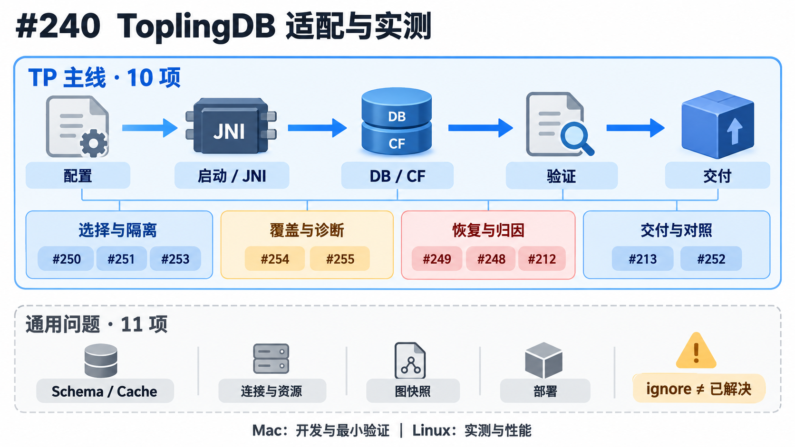

# ToplingDB issue 图片

对应 [Summary #240](https://github.com/hugegraph/hugegraph/issues/240) 与 TP 主线 10 个子 issue。

使用内置 `image_gen` 生成；完整提示词见 [prompts.json](prompts.json)。图示说明问题和目标，不代替 issue 正文中的验证证据。

| Issue | 主题 | 图片 |
| --- | --- | --- |
| [#240](https://github.com/hugegraph/hugegraph/issues/240) | 全局总览 | [查看图片](issue-240-overview.png) |
| [#250](https://github.com/hugegraph/hugegraph/issues/250) | 统一 provider 来源 | [查看图片](issue-250-provider-source.png) |
| [#251](https://github.com/hugegraph/hugegraph/issues/251) | 实际 graphs 目录 | [查看图片](issue-251-graphs-directory.png) |
| [#253](https://github.com/hugegraph/hugegraph/issues/253) | 所有图的数据根校验 | [查看图片](issue-253-all-data-roots.png) |
| [#254](https://github.com/hugegraph/hugegraph/issues/254) | 多 key truncate 覆盖 | [查看图片](issue-254-truncate-coverage.png) |
| [#255](https://github.com/hugegraph/hugegraph/issues/255) | native 诊断分类 | [查看图片](issue-255-diagnostic-gates.png) |
| [#249](https://github.com/hugegraph/hugegraph/issues/249) | WAL 恢复失败安全 | [查看图片](issue-249-wal-recovery.png) |
| [#248](https://github.com/hugegraph/hugegraph/issues/248) | 重启后不可见的调查 | [查看图片](issue-248-restart-investigation.png) |
| [#212](https://github.com/hugegraph/hugegraph/issues/212) | DB / CF 生命周期 | [查看图片](issue-212-cf-lifecycle.png) |
| [#213](https://github.com/hugegraph/hugegraph/issues/213) | JNI 可追溯交付 | [查看图片](issue-213-jni-provenance.png) |
| [#252](https://github.com/hugegraph/hugegraph/issues/252) | 固定 workload 对照 | [查看图片](issue-252-benchmark-plan.png) |

## 总览

## 使用说明

- 每张图与一个 issue 对应，点击图片可查看原尺寸。
- 已确认缺口、待归因线索、历史验证和目标状态分别表达。
- 非 TP 专属的通用子 issue 不在此图片集范围内。
